# Proyecto en Programación Orientada a Objetos

## Conceptos y Tecnologías Aplicadas

- Programación Orientada a Objetos (POO)
- Clean Architecture (Arquitectura Limpia)
- Patrones de diseño
- Python
- Menú interactivo en consola
- Almacenamiento en SQLite
- Almacenamiento en Memoria Volátil (RAM)
- Testing
- Documentación

## Patrones de diseño implementados

### Patrones Creacionales

#### Factory Method (ProductFactory)

Dónde:

- `Interfaces.Adapters.ProductFactory`
- Método: `create_product(kind: str, **kwargs): Product`

Qué hace:

- Según el `kind` (`"book"`, `"accessory"`, etc.) devuelve una instancia de:
    - `BookProduct`
    - `AccessoryProduct`
    - `Product` genérico

Por qué es Factory Method:

- Un método que decide en tiempo de ejecución qué subtipo de `Product` crear.
- Encapsula la lógica de construcción y respeta el polimorfismo.
- El código cliente no necesita saber qué subclase instanciar ni cómo.

#### Singleton (SQLiteConnection)

Dónde:

- `Infrastructure.Repositories.SQLiteConnection`

Qué hace:

- Asegura que en toda la aplicación se use una sola instancia de conexión a la base de datos SQLite.
- Usa un atributo de clase `_instance` y un `Lock` para control de concurrencia.

Por qué es Singleton:

- El método `__new__` controla que solo se cree una instancia.
- El resto de clases (repositorios SQLite) piden la conexión vía `get_connection()`, no crean conexiones nuevas.

### Patrones estructurales

#### Repository (InventoryRepository, OrderRepository + implementaciones)

Dónde:

- Interfaces:
    - `Interfaces.Repositories.InventoryRepository`
    - `Interfaces.Repositories.OrderRepository`
- Implementaciones:
    - `Infrastructure.Repositories.InventoryMemoryRepository`
    - `Infrastructure.Repositories.InventorySQLiteRepository`
    - `Infrastructure.Repositories.OrderMemoryRepository`
    - `Infrastructure.Repositories.OrderSQLiteRepository`

Qué hace:

- Oculta los detalles de persistencia (memoria vs SQLite).
- Expone una interfaz orientada al dominio:
    - `add_product`, `get_product`, `list_products`, `remove_product`
    - `save`, `get`, `list_all`, `delete`

Por qué es Repository:

- El dominio y los use cases trabajan con una colección de entidades como si fuera una lista o colección en memoria.
- No dependen de SQL, diccionarios, ni detalles de almacenamiento.

#### Presenter / ViewModel (OrderPresenter)

Dónde:

- `Interfaces.Adapters.OrderPresenter`
- Método: `format_order_as_table(order: Order): str`

Qué hace:

- Toma una entidad de dominio (`Order`) y la transforma en una representación de salida (tabla de texto para la CLI).
- Separa la forma de mostrar la orden de la lógica de negocio.

Por qué es un Presenter:

- Es un adaptador de presentación típico de Clean Architecture: dominio → modelo de vista / string listo para la UI.

#### Ports & Adapters (Arquitectura de puertos)

Dónde:

- Puertos (interfaces):
    - `InventoryRepository`, `OrderRepository`
- Adaptadores:
    - Repositorios en memoria / SQLite
    - `ProductFactory`, `OrderPresenter`
    - `InventoryMenu`, `OrderMenu`, `MenuManager`

Qué hace:

- Separa el núcleo (dominio + use cases) de:
    - la UI (CLI),
    - la persistencia (memoria / SQLite),
    - la creación de objetos, etc.

Por qué es Ports & Adapters:

- El dominio y la capa de aplicación solo conocen interfaces, no detalles concretos.
- Las clases de infraestructura se “enchufan” implementando esas interfaces.

### Patrones de comportamiento

#### Strategy (elección de persistencia en tiempo de ejecución)

Dónde:

- `MenuManager._select_persistence()` Elige entre:
    - `InventoryMemoryRepository` / `OrderMemoryRepository`
    - `InventorySQLiteRepository` / `OrderSQLiteRepository`

Qué hace:

- Permite cambiar la “estrategia” de persistencia (memoria vs BD) en tiempo de ejecución.
- El resto del sistema interactúa solo con `InventoryRepository` y `OrderRepository`.

Por qué se parece a Strategy:

- `InventoryRepository` y `OrderRepository` actúan como la interfaz de estrategia.
- Las implementaciones concretas son las estrategias (memoria / SQLite).
- `MenuManager` selecciona qué estrategia usar según la opción del usuario.

> *(Es Strategy + Repository + Dependency Inversion, todo amiguitos 💚.)*

#### Application Service / Use Case (similar a Command)

Dónde:

- `Application.UseCases.Inventory.*`
    - `AddProductUseCase`, `GetProductUseCase`, `ListProductsUseCase`, `RemoveProductUseCase`
- `Application.UseCases.Order.*`
    - `SaveOrderUseCase`, `GetOrderUseCase`, `ListAllOrdersUseCase`, `DeleteOrderUseCase`

Qué hace:

- Cada clase representa un caso de uso de la aplicación.
- Encapsula un proceso de negocio en el método `execute(...)`.
- Coordina repositorios, manejo de errores y reglas de aplicación.

Por qué es un patrón:

- Es el típico patrón de Application Service / Use Case de Clean Architecture y DDD.
- Muy parecido al patrón Command (un objeto por operación), pero con semántica de caso de uso.

### Patrones arquitectónicos

#### Clean Architecture / Capas + Dependency Inversion

Dónde:

- Paquetes:
    - `Domain.Entities`, `Domain.Exceptions`
    - `Application.UseCases.*`, `Application.Seeder`
    - `Interfaces.Adapters`, `Interfaces.Repositories`
    - `Infrastructure.Repositories`, `Infrastructure.CLI`

Qué hace:

- Separa el sistema en capas:
    - Dominio (reglas de negocio puras).
    - Casos de uso (orquestación de reglas).
    - Interfaces (puertos, adaptadores, presenters, factories).
    - Infraestructura (detalles concretos: CLI, SQLite, memoria).
- El flujo de dependencias es hacia adentro (infra → interfaces → application → domain), también se le conoce como Onion Architecture.

Por qué es un patrón arquitectónico:

- Sigue el principio de Dependency Inversion:
    - El dominio define las abstracciones (interfaces).
    - La infraestructura implementa los detalles.
- Esto permite cambiar UI, BD o factories sin romper el corazón del sistema.

## Visualización Diagrama de clases

> Haz clic sobre el enlace para ver más (Redirige a Mermaid Live Editor)

[Class Diagram](https://mermaid.live/edit#pako:eNqtWtty2zgS_RUUq2ZHzspKfIs93EyqNLKcVZVvI9svU6xiwSSkYEICNEBq7GScn9gvmA_Yp7zNq39sG-BFIAnKTDauVEwR3Y1GX053Q_7kBDwkjusEEZbymOKlwLHHQipIkFLO0OncYx774Qf0s_1HrxU_xxdn49n5ZmqGYyITHBB0zGNM2WjKUppSItEnjykhWhF0KXiYBWn5Uv38k4Yukqkw3ihhzXeJoAG8XEQcp8brAKdkycVDk3xJUn9BGY58zTjYarP6PrD4vlqqeB-VVdbq_sL5B5vKOEvfc_F1ezZEj4OASAma2-TfCszC_0v8hQiJmKUkrslN8r3c0g_G0l2GlcfAkJSljV1ldpvyFEc9tnzGsxQ0ki46pTL9XKn42bRsGPqKaJBUSg7RnVYKNl9xGhrEgsR8RQr6nNgv9mwTBzgKsgjCxe84iz5OO47vA5KolGlE8oytCEvBf1MhuLDE-DlPT3jGQr1u84JfM8-jRcQ4EgSHD9N7MJfsL6fllJaK-m23glwtt8Q-FogxJxEOwCCQ2yGYQHD4FaGQx5RR7rEynt_8ub1dSyAX_ZsIwgKKG0StVDAp86jynB3PQS-2t9_CY4zZA3xah7iLJjxOuKQBffrC0CDnCbhSLsJIZhLpwNsqxGkmJWu94Vhy2K7gF2RR7I9wSbOlo4OnBC3AWqVWNwwXz0SmT3_BnnGSwSNGCVBljCOO4qe_jHwcoSuKopJLEkQiCpbDQ63mWr2Q_I4Z_I9SwjQhZGfIR57T1kPTe876WfKIo2WGRYhBB4xs5xmhaVSdH4CaEbSiQA9BlQAdYaAYZJ0KcixouXG_kjG-vDydTcbXs4veVWOcJBEFMIe4Gt1IMsGSyFGVY_XUG4dhoXhBWQteck-CLCWDJtbVEKGWbe9I2l-eATA1EK1JVPhWrMpNMrcKKCxoP1tEzTXGfZN-t5xHXehmtbeOoJqpr_CK6LebdtZw4eaxuNHK_SQZJ9AMHfYdR5Fe7mVgTWkz7zGJSEq-WrHaGTeY9ooQoyg2Kkd9Ue8n4VXpSaiTkM0C30akCpAhokvGBfGJAm2Z-7jb5vpcXdvoM5mb5EbqtcVjfzCYnV9P5yfjyfSqLxbMGGi0gCc5Goc4gQ-N2qsVvRREgWLjZACKMU793F9Y-qk6WTNCu4plYeUTHJigk3cPUImhdShcM_hAi_5siF68-PAHFktpAYRGYBjnmhNVrmCXVodcRUdFUlPkzRtaSnn7ttE3lcoldswzW6aS1AYWVdvXJmq3jRFkV0kou_Gs5b2vO50EGOqGGU0S6kTeeKCBFVjWx8BR1AUYveN9dn4yH19dz28m1zfzaf-IXwgMmoHNMkH6RMcZ-LErRrb9NYIcU3CDjtMNNWaNSL-eQqPUIRX6KaY6LcbyGdLcsEiPPNuaYNFy_mblS1xaq96J3jm-fQ-l5aAVUtt-jJMqCQT_o0-G1_x4jEG2UVKKmqr1Xatk0VfeRUCyN7LprVMzqBaU3k2yZxWbnM4644plNYVoueILsLBrwycTXjJmM6SJTpZlE2wsyy2MaRI0QK1H_DUOmZeL_IANePrepiiCTu_YZYvORW2JPD9syzkG2tgbVlAGOMMML-vV8-tO2M9qXXaQoCt0qwkcBQ4FwwmxURX9l68bFmuGUubHcBo_4jwZWNuUZ0F7Pj0dT2BWmV6h6fn1fIom48vxM92KXjU6PQTT5Lq-o0HCYazjYkFlzNHq6b8YVZVNjaHtEWZbC2jXfsBBkhAGgyD8G1D2QIJ8SoWPyvQgrD2_9BHmMduU0o_TOpT0Y_VYa6ZQjM2moM7UnB2e57BOCM-zWcaB55k81mzpu00xY5KIVI_ZynZcokxiFnI1bSt32mW1w8WFwTBLaUQ_YhQ9fVlCGKqICLBU1zEglCu9zP7ffo5Sn6cvsKSudJrqNEW0vNdPk-rGon0Uz5msadUvrLNKR_kInXN1kcMDZeoUOjR96wTJBPWMlAUN_yu_8oiqLPtoM795h2Hm6iLv918m5USxpbI5v_-rrqrKoaB-bTQBNIc9ZYrV7YrU4WBhqF-D9WSyXIvZOAsXrcehytHAcKLHIVJeNyVYYGWlm1nNJ43NPad8IkxRBzjBudGr-QWgT_kI1WAuJCserSgp4kfdGtNEuU-obx20a8ujSLJ8-puhH9Uc9WPNL3ESkVhdOhVXjOB8KJkpbmDqlpEoRkC_-XM02tAku4b8KlT6SGr1mB2SCmc05di73g4Z3RL6a1G51nY0z5mVWQIuSTIAAI7eY3U9CN5eV2SqvV4h1Qidghdot4NWdKWuDdmmccZ6gfnNupWoNUKXRMRgm9wIAY5vKRYoVhan-GVuNyQpQ3gBoQhLRlibcGNE4uTi7PLiajaZPf3nHL1E43fz6btx_gmOSGtHNEKo5WXeuGheCrI08R-EFXoWrrdLKDO64K_w2mQ3i0czVPTdeWv0aN6cA_orh5J7_VHdZmOR0hCXN-ffX6wRCy0xnnNF2RIqMjzfZVBT1NcNOK80pkD9UQ9aqiJjHatVUQrzu_gITC2qQOTlGGZ6HLrip78l-FqNRwqAjfbuH0bFqHkbJok-jU9UxrLG0fJW3SbJVusnHHptynC9qrZ5251gf15bN9if29oRdrFXgV4wb2qvTMOVQd_ktxv_lBAzze41cKRtbktHY1e7ztbsSftxWfvSfqyW3rQfY6M_cNENpKNuBRZFe6DxUEJmhdiGfirtCOLiTn-1FUI2PQDoqGTxmDlKvqg5Q-_fRILqS7mABpFWeJXjQEvO-gzfJKM7Ls7UF93q-y7za7G83UXQ99AVb0tqR-i3SGm29i6a_q7mW7A9vGhCg1WHTs51bhiIaorwnMuM5XmkYTTUxQ-sCGin-ovcuYVfhwpdF3QJvXU1bdaKL_SGSoFqUWq98vLuDJ2loKHjQnkkQyeG0ozVR0dfNXhO-h4aCM9x4TEkC5xFqeJ6BLYEs984j0tOwbPle8dd4EjCpywBaCfF37JUJAomxITD0Rx35-jwtRbiuJ-ce8fd3dsf7e-_2n_1097-0dH-zs7h0Hlw3O39Vwej_d2d14e7O7tHO4cHr_Yeh85HvfHO6Ohgb2_v9eHeT7sHRwe7e0OHhMrnZ8Xf06hfj_8D8hAThw)

## Código Mermaid Diagrama de clases

```mermaid
classDiagram
direction LR

%% =======================
%%        DOMAIN
%% =======================
namespace Domain.Entities {
    class Product {
        +id: str
        +name: str
        +price: float
        +category: str
        +get_final_price(): float
        +__str__(): str
    }

    class BookProduct {
        +author: str
        +get_final_price(): float
    }

    class AccessoryProduct {
        +brand: str
        +get_final_price(): float
    }

    class OrderItem {
        +product: Product
        +quantity: int
        +get_subtotal(): float
    }

    class Order {
        +id: str
        +items: List~OrderItem~
        +add_item(p: Product, q: int): void
        +remove_item(product_id: str): void
        +calculate_total(): float
    }
}

namespace Domain.Exceptions {
    class InventoryError
    class ProductNotFoundError {
        +product_id: str
    }
    class ProductAlreadyExistsError {
        +product_id: str
    }

    class OrderError
    class OrderNotFoundError {
        +order_id: str
    }
}

%% Relaciones dentro del dominio
Product <|-- BookProduct : Herencia
Product <|-- AccessoryProduct : Herencia
Order "1" *--> "many" OrderItem : Composición (Order controla sus items)
OrderItem --> Product : Asociación (referencia a Product)

note for Order "Una Order está compuesta por uno o más OrderItem. Si la Order se elimina, sus OrderItem dejan de tener sentido."

note for OrderItem "OrderItem solo guarda una referencia a Product. El Product tiene vida propia en el inventario."


%% =======================
%%      APPLICATION
%% =======================
namespace Application.UseCases.Inventory {
    class AddProductUseCase {
        +execute(product: Product): void
    }
    class GetProductUseCase {
        +execute(product_id: str): Product
    }
    class ListProductsUseCase {
        +execute(): List~Product~
    }
    class RemoveProductUseCase {
        +execute(product_id: str): bool
    }
}

namespace Application.UseCases.Order{
    class SaveOrderUseCase {
        +execute(order: Order): void
    }
    class GetOrderUseCase {
        +execute(order_id: str): Order
    }
    class ListAllOrdersUseCase {
        +execute(): List~Order~
    }
    class DeleteOrderUseCase {
        +execute(order_id: str): void
    }
}

namespace Application.Seeder {
    class InventorySeeder {
        +seed(products: Iterable~Product~, ignore_errors: bool): void
    }
    class OrderSeeder {
        +seed(orders: Iterable~Order~, ignore_errors: bool): void
    }
}


%% =======================
%%      INTERFACES
%% =======================
namespace Interfaces.Adapters {
    class OrderPresenter {
        +format_order_as_table(order: Order): str
    }

    class ProductFactory {
        +create_product(kind: str, **kwargs): Product
    }
}

namespace Interfaces.Repositories {
    class InventoryRepository {
        <<interface>>
        +add_product(p: Product): void
        +remove_product(id: str): bool
        +get_product(id: str): Product
        +list_products(): List~Product~
    }

    class OrderRepository {
        <<interface>>
        +save(order: Order): void
        +delete(id: str): bool
        +get(id: str): Order
        +list_all(): List~Order~
    }
}


%% =======================
%%    INFRASTRUCTURE
%% =======================
namespace Infrastructure.Repositories {
    class InventoryMemoryRepository {
        -_products: Dict~str, Product~
    }
    class InventorySQLiteRepository {
        -conn: Connection
        -_create_table(): void
    }

    class OrderMemoryRepository {
        -_orders: Dict~str, Order~
    }
    class OrderSQLiteRepository {
        -conn: Connection
        -_create_tables(): void
        -_map_product(row): Product
    }
}

namespace Infrastructure.Database {
    class SQLiteConnection {
        -conn: sqlite3.Connection
        +get_connection(): Connection
    }
}

namespace Infrastructure.CLI {
    class InventoryMenu {
        -inventory_repo: InventoryRepository
        +run(): void
        -_add_product(): void
        -_get_product(): void
        -_list_products(): void
        -_remove_product(): void
    }

    class OrderMenu {
        -order_repo: OrderRepository
        -inventory_repo: InventoryRepository
        +run(): void
        -_create_order(): void
        -_get_order(): void
        -_list_orders(): void
        -_delete_order(): void
    }

    class MenuManager {
        -inventory_repo: InventoryRepository
        -order_repo: OrderRepository
        +run(): void
        -_select_persistence(): void
        -_execute_seed(): void
        -_main_menu_loop(): void
    }
}

%% =======================
%%   RELACIONES ENTRE CAPAS
%% =======================

%% Application -> Interfaces (polimorfismo vía interfaces)
AddProductUseCase --> InventoryRepository : Depende de (inyección de repo)
GetProductUseCase --> InventoryRepository : Depende de
ListProductsUseCase --> InventoryRepository : Depende de
RemoveProductUseCase --> InventoryRepository : Depende de

SaveOrderUseCase --> OrderRepository : Depende de
GetOrderUseCase --> OrderRepository : Depende de
ListAllOrdersUseCase --> OrderRepository : Depende de
DeleteOrderUseCase --> OrderRepository : Depende de

InventorySeeder --> InventoryRepository : Inserta productos usando el repo
InventorySeeder --> AddProductUseCase : Reutiliza lógica de caso de uso

OrderSeeder --> OrderRepository : Inserta órdenes usando el repo
OrderSeeder --> SaveOrderUseCase : Reutiliza lógica de caso de uso

note for AddProductUseCase "Caso de uso de aplicación. No conoce detalles de infraestructura; solo la interfaz InventoryRepository."


%% Interfaces (factory/presenter) -> Domain
ProductFactory --> Product : Crea instancias de
ProductFactory --> BookProduct : Crea instancias de
ProductFactory --> AccessoryProduct : Crea instancias de

OrderPresenter --> Order : Formatea Order para la UI

note for ProductFactory "Factory en la capa de interfaces. Aplica polimorfismo devolviendo el subtipo correcto de Product según 'kind'."


%% Implementaciones concretas (polimorfismo)
InventoryRepository <|.. InventoryMemoryRepository : Implementa interfaz
InventoryRepository <|.. InventorySQLiteRepository : Implementa interfaz

OrderRepository <|.. OrderMemoryRepository : Implementa interfaz
OrderRepository <|.. OrderSQLiteRepository : Implementa interfaz

note for InventoryRepository "Interfaz de puerto hacia la persistencia de productos. Las implementaciones concretas viven en Infrastructure.Repositories."

note for OrderRepository "Interfaz de puerto hacia la persistencia de órdenes. Permite intercambiar memoria/SQLite sin afectar la capa de aplicación."


%% COMPOSICIÓN / AGREGACIÓN en infrastructure
InventoryMemoryRepository o--> Product : Agrega productos en memoria
OrderMemoryRepository o--> Order : Agrega órdenes en memoria

InventorySQLiteRepository *--> SQLiteConnection : Composición (usa conexión compartida)
OrderSQLiteRepository *--> SQLiteConnection : Composición (usa conexión compartida)

note for SQLiteConnection "Singleton que centraliza la conexión a la base de datos. Reutilizada por los repositorios SQLite."


%% Menús / CLI -> Application & Interfaces
InventoryMenu --> InventoryRepository : Depende del puerto de inventario
InventoryMenu --> AddProductUseCase : Coordina caso de uso
InventoryMenu --> GetProductUseCase : Coordina caso de uso
InventoryMenu --> ListProductsUseCase : Coordina caso de uso
InventoryMenu --> RemoveProductUseCase : Coordina caso de uso

OrderMenu --> OrderRepository : Depende del puerto de órdenes
OrderMenu --> InventoryRepository : Lee productos existentes
OrderMenu --> SaveOrderUseCase : Coordina caso de uso
OrderMenu --> GetOrderUseCase : Coordina caso de uso
OrderMenu --> ListAllOrdersUseCase : Coordina caso de uso
OrderMenu --> DeleteOrderUseCase : Coordina caso de uso
OrderMenu --> OrderPresenter : Usa para formatear la salida

%% COMPOSICIÓN entre orquestador y menús
MenuManager *--> InventoryMenu : Composición (controla ciclo de vida)
MenuManager *--> OrderMenu : Composición (controla ciclo de vida)
MenuManager --> InventoryRepository : Mantiene referencia al repo activo
MenuManager --> OrderRepository : Mantiene referencia al repo activo
MenuManager --> InventorySeeder : Ejecuta seed de inventario
MenuManager --> OrderSeeder : Ejecuta seed de órdenes

note for MenuManager "Punto de entrada de la CLI. Orquesta menús, configuración de persistencia y ejecución de seeders."
```

